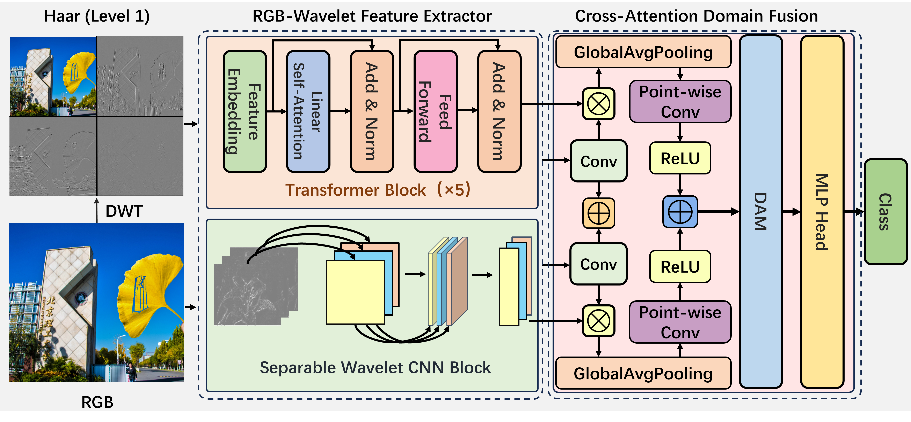

# A Unified RGB-Wavelet Dual-Domain Framework for Visual Representation Learning

We propose a novel unified dual-domain framework, named RWT, which jointly exploits RGB and wavelet domain representations to capture both global dependencies as well as localized frequency information. 

In the RGB domain, multi-head self-attention is employed to extract long-range interactions, 

while in the wavelet domain, Discrete Wavelet Transform (DWT) facilitates invertible downsampling by decomposing images into low-frequency (structural) and high-frequency (textural) components, 

which are then processed via depthwise separable convolutions.<br />

<p align="center">
    
    <br />
</p>


## Contents

- [Directory Structure](#directory-structure)
- [Acknowledgements](#acknowledgements)


## Directory Structure

```
├── LICENSE.txt
├── README.md
├── /data/
├── /weights/
├── /docs/
├── predict.py
├── train.py
├── utils.py
└── vit_wav2.py
```

### Acknowledgements


- [Deep Learning for Image Processing](https://github.com/WZMIAOMIAO/deep-learning-for-image-processing)

<!-- links -->
